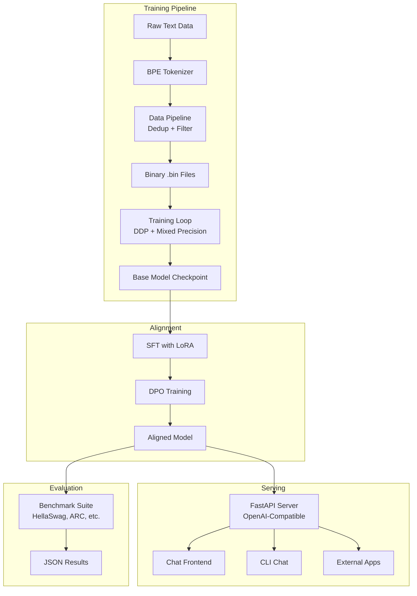

# 🧠 OpenMind LLM — Complete Project Walkthrough

## Project Overview

OpenMind is a **complete, from-scratch implementation** of a GPT-style language model. Every component — from the tokenizer to the transformer model to the chat UI — is built transparently.

---

## 📸 Chat Dashboard Preview

````carousel

<!-- slide -->

````

---

## ✅ What's Been Built (All 12 Phases)

| Phase | Component | Files Created | Status |
|-------|-----------|---------------|--------|
| 1 | **Project Scaffold** | `requirements.txt`, `setup.py`, configs, `__init__.py` files | ✅ Done |
| 2 | **BPE Tokenizer** | [tokenizer.py](file:///c:/Users/rachi/OneDrive/Desktop/OpenAi/openmind/src/data/tokenizer.py) | ✅ Done |
| 3 | **GPT Transformer** | [modeling_openmind.py](file:///c:/Users/rachi/OneDrive/Desktop/OpenAi/openmind/src/models/modeling_openmind.py), [config_openmind.py](file:///c:/Users/rachi/OneDrive/Desktop/OpenAi/openmind/src/models/config_openmind.py) | ✅ Done |
| 4 | **Data Pipeline** | [pipeline.py](file:///c:/Users/rachi/OneDrive/Desktop/OpenAi/openmind/src/data/pipeline.py) | ✅ Done |
| 5 | **Training Loop** | [train.py](file:///c:/Users/rachi/OneDrive/Desktop/OpenAi/openmind/src/training/train.py) | ✅ Done |
| 6 | **Fine-Tuning** | [sft_train.py](file:///c:/Users/rachi/OneDrive/Desktop/OpenAi/openmind/src/training/sft_train.py), [dpo_train.py](file:///c:/Users/rachi/OneDrive/Desktop/OpenAi/openmind/src/training/dpo_train.py) | ✅ Done |
| 7 | **Evaluation** | [run_eval.py](file:///c:/Users/rachi/OneDrive/Desktop/OpenAi/openmind/src/evaluation/run_eval.py) | ✅ Done |
| 8 | **API Server** | [api_server.py](file:///c:/Users/rachi/OneDrive/Desktop/OpenAi/openmind/src/inference/api_server.py) | ✅ Done |
| 9 | **Web Frontend** | [index.html](file:///c:/Users/rachi/OneDrive/Desktop/OpenAi/openmind/frontend/index.html), [style.css](file:///c:/Users/rachi/OneDrive/Desktop/OpenAi/openmind/frontend/css/style.css), [app.js](file:///c:/Users/rachi/OneDrive/Desktop/OpenAi/openmind/frontend/js/app.js) | ✅ Done |
| 10 | **Docker** | Dockerfiles + docker-compose.yml | ✅ Done |
| 11 | **CLI Tool** | [main.py](file:///c:/Users/rachi/OneDrive/Desktop/OpenAi/openmind/src/cli/main.py) | ✅ Done |
| 12 | **Testing & CI** | 4 test files + [ci.yml](file:///c:/Users/rachi/OneDrive/Desktop/OpenAi/openmind/.github/workflows/ci.yml) | ✅ Done |

---

## 🏗️ Architecture Diagram



---

## 🔑 Key Technical Decisions

### Model Architecture (125M params)
- **RoPE** instead of learned positional embeddings → better length generalization
- **RMSNorm** instead of LayerNorm → 10-15% faster, equally effective
- **SwiGLU** instead of GELU → proven better in LLaMA and Mistral
- **GQA support** → ready for larger models with KV-cache efficiency
- **KV-Cache** → fast autoregressive generation

### Training
- **Cosine LR with warmup** → standard for LLM training
- **AdamW with β2=0.95** → better for language models than default 0.999
- **Gradient accumulation** → simulate large batches on small GPUs
- **BF16/FP16 mixed precision** → 2x memory savings

### Frontend
- **Vanilla HTML/CSS/JS** → no build step, opens directly in browser
- **SSE streaming** → real-time token-by-token display
- **Local storage** → conversations persist across sessions
- **Demo mode** → works without API server for UI testing

---

## 🎓 Next Steps: Training on Google Colab

> [!IMPORTANT]
> The codebase is complete. The next step is **training the model** on Google Colab (free T4 GPU).

### Quick Steps:
1. Push this project to your GitHub repo
2. Open [Google Colab](https://colab.research.google.com) → New Notebook → **T4 GPU**
3. Follow the cells in the [README.md](file:///c:/Users/rachi/OneDrive/Desktop/OpenAi/openmind/README.md) "Google Colab Training Guide" section
4. Training takes **~2-4 hours** on a free T4 for 10K steps
5. Download the trained model and place it in `models/checkpoints/`
6. Start the server: `python src/inference/api_server.py --model models/checkpoints/openmind-125m`

### What to Expect from 125M Trained on TinyStories:
- **Good**: Coherent story generation, basic Q&A, simple code
- **Limited**: Complex reasoning, factual accuracy, long context
- **Improvement path**: Train on larger data (FineWeb), scale to 350M+

---

## 📁 Complete File Inventory (38 files created)

```
openmind/
├── .github/workflows/ci.yml          # CI/CD pipeline
├── .gitignore                        # Git ignores
├── README.md                         # Full documentation
├── docker-compose.yml                # Full stack deployment
├── requirements.txt                  # Python dependencies
├── setup.py                          # Package configuration
├── configs/
│   ├── base_config.yaml              # 125M training config
│   └── finetune_config.yaml          # LoRA/DPO config
├── data/.gitkeep
├── models/.gitkeep
├── docker/
│   ├── Dockerfile.train              # GPU training image
│   ├── Dockerfile.serve              # API server image
│   └── Dockerfile.frontend           # Nginx frontend image
├── frontend/
│   ├── index.html                    # Chat dashboard
│   ├── css/style.css                 # Premium design system
│   └── js/app.js                     # Chat application logic
├── scripts/
│   └── launch_train.sh               # Training launcher
├── src/
│   ├── __init__.py
│   ├── cli/
│   │   ├── __init__.py
│   │   └── main.py                   # CLI tool (6 commands)
│   ├── data/
│   │   ├── __init__.py
│   │   ├── tokenizer.py              # BPE tokenizer from scratch
│   │   ├── pipeline.py               # Data processing pipeline
│   │   └── chat_templates.py         # Alpaca/ShareGPT/HH-RLHF parsers
│   ├── evaluation/
│   │   ├── __init__.py
│   │   └── run_eval.py               # Benchmark suite
│   ├── inference/
│   │   ├── __init__.py
│   │   └── api_server.py             # OpenAI-compatible API
│   ├── models/
│   │   ├── __init__.py
│   │   ├── config_openmind.py        # Model configuration
│   │   └── modeling_openmind.py      # Transformer architecture
│   ├── training/
│   │   ├── __init__.py
│   │   ├── train.py                  # Pretraining script
│   │   ├── sft_train.py              # Supervised fine-tuning
│   │   └── dpo_train.py              # DPO alignment
│   └── utils/
│       ├── __init__.py
│       └── helpers.py                # Utility functions
└── tests/
    ├── test_tokenizer.py             # 9 tokenizer tests
    ├── test_model.py                 # 15 model tests
    ├── test_data.py                  # 12 data pipeline tests
    └── test_api.py                   # 5 API tests
```
